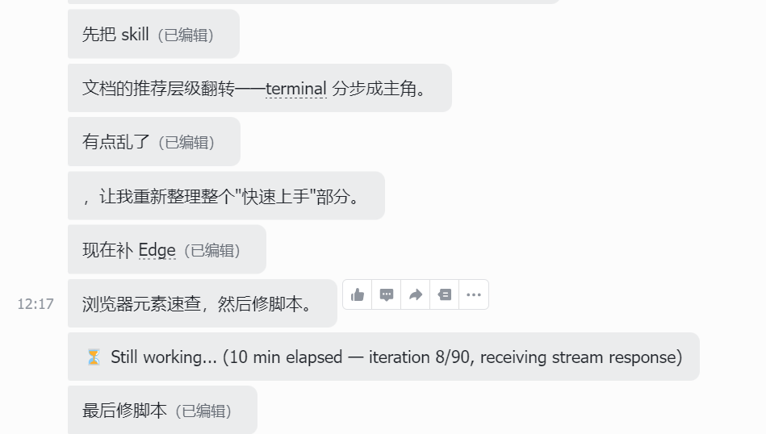
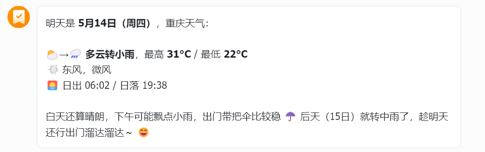
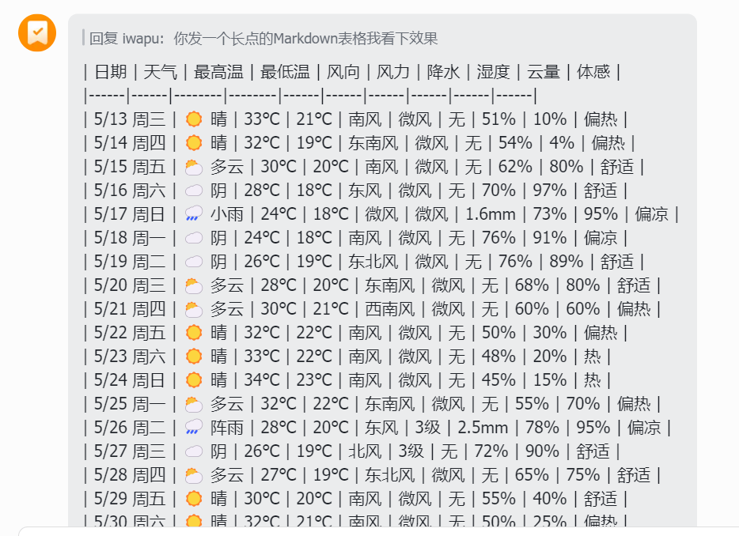
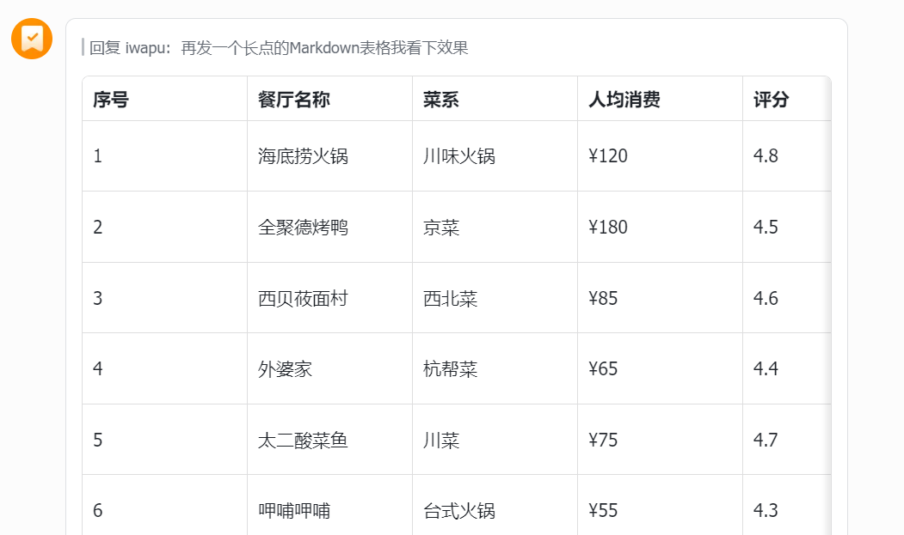

# Hermes Custom Feishu — CardKit 2.0 Streaming Interactive Card Adapter

[中文](README.md)

A custom Hermes platform adapter built on Feishu's **CardKit 2.0**, delivering truly **streaming interactive card** replies for Feishu bots.

Compared to Hermes' built-in Feishu channel, this plugin addresses key pain points: poor message formatting, lack of table/code block support, and a fragmented streaming experience.

## Comparison with Built-in Feishu Channel

| Feature | Built-in Feishu | This Custom Channel |
|---------|----------------|---------------------|
| Message Type | Plain text / basic interactive cards | CardKit 2.0 streaming interactive cards |
| Streaming | Multiple message edits, disjointed | Progressive updates within a single card |
| Markdown Tables | Unsupported or broken | Native support |
| Code Blocks | Formatting lost | Native support with syntax highlighting |
| Message Aggregation | Each update overwrites the last | All content in one card |
| Footer | None | Profile name, elapsed time, model/provider |
| Cron Jobs | No special handling | Yellow header card, auto-finalize |
| Tool Calls | Mixed with replies | Separate cards for tool calls and replies |

### Visual Comparison

#### Message Replies

| Built-in | Custom |
|----------|--------|
|  |  |

#### Table Rendering

| Built-in | Custom |
|----------|--------|
|  |  |

The built-in channel renders tables as misaligned plain text. The custom channel uses CardKit 2.0's native Markdown rendering for clean, readable tables.

## How It Works

```
Hermes AI Agent
    │
    ▼
run_conversation()  ← Model tracking (monkey-patch)
    │
    ▼
FeishuCustomAdapter
    │
    ├── send()          → CardKit 2.0 create card → stream content
    ├── edit_message()  → Append text → or finalize
    └── _cardkit_finalize() → Disable streaming → add footer
    │
    ▼
Feishu Client (user sees a progressively updating card)
```

Key technical details:

- **CardKit 2.0 Streaming**: Uses `lark_oapi.api.cardkit`'s `content_card_element` API to push content to the same `element_id` with incrementing `sequence` numbers
- **Single Card Reuse**: Within a conversation turn, the same card is reused — `send()` detects content continuity and appends rather than creating a new card
- **Segment Boundary Detection**: When the stream consumer resets (across tool calls), the old card is automatically finalized and a new one created
- **Model Tracking**: Monkey-patches `AIAgent.run_conversation` and `_try_activate_fallback` to capture the actual model/provider in use (including after fallback), displayed in the footer

## Installation

### 1. Clone the Repository

```bash
cd ~/.hermes/plugins/platforms/
git clone https://github.com/tscodeplus/hermes-feishu-custom.git feishu_custom
```

### 2. Install Dependencies

```bash
pip install 'lark-oapi>=1.5.3,<2'
```

> Note: This plugin does **not** bundle its own copy of `lark-oapi`. Version ≥ 1.5.3 is required for CardKit 2.0 API support.

### 3. Configure Environment Variables

Add to Hermes' `.env` or system environment:

```bash
# Required — Feishu app credentials
FEISHU_CUSTOM_APP_ID=cli_xxxxxxxxxxxx
FEISHU_CUSTOM_APP_SECRET=xxxxxxxxxxxxxxxxxxxxxxxxxx

# Optional — User access control
FEISHU_CUSTOM_ALLOW_ALL_USERS=true          # Allow all users (dev/test)
# FEISHU_CUSTOM_ALLOWED_USERS=user_id_1,user_id_2  # Restrict to specific users

# Optional — Advanced
FEISHU_CUSTOM_LARK_HOST=feishu              # feishu (China) or lark (international)
FEISHU_CUSTOM_CONNECTION_MODE=websocket     # websocket or webhook
FEISHU_CUSTOM_MAX_MESSAGE_LENGTH=15000      # Max message length in characters
```

### 4. Configure Hermes

Edit Hermes' `config.yaml` (typically at `~/.hermes/config.yaml`):

```yaml
platforms:
  # Important: disable the built-in Feishu channel to avoid conflicts
  feishu:
    enabled: false

  # Enable the custom channel
  feishu_custom:
    enabled: true
```

## Feishu App Configuration

Ensure your Feishu app has the following permissions:

- `im:message` — Send and receive messages
- `im:message.p2p_msg:readonly` — Read direct messages
- `im:message.group_msg:readonly` — Read group messages
- `im:message:send_as_bot` — Send messages as bot

In the Feishu Open Platform under "Event Subscriptions", configure:
- Subscribe to the `im.message.receive_v1` event
- Point the request URL to your Hermes gateway endpoint

## Feature Details

### Streaming Card Lifecycle

1. **Create**: Upon receiving a user message, a CardKit 2.0 card is created immediately showing "Thinking..."
2. **Stream**: As the AI generates content, each `send()` call updates the same card element, progressively appending text
3. **Finalize**: When the conversation ends, `edit_message(finalize=True)` disables streaming mode and adds the footer (profile · elapsed time · model/provider)
4. **Auto-finalize**: One-shot messages like cron jobs auto-finalize after 3 seconds

### Tool Call Separation

When the AI invokes a tool and continues reasoning after receiving the result, the tool call card is finalized automatically and a new card is created for the subsequent reply. This keeps tool calls and AI responses visually separated.

### Card Footer

Each finalized card displays a footer:

> profile_name · 15.3s · openai/gpt-4o

Including:
- **Profile name**: The active Hermes profile
- **Elapsed time**: Actual time from first message to finalization
- **Model info**: The actual model and provider used (including post-fallback)

## License

MIT
